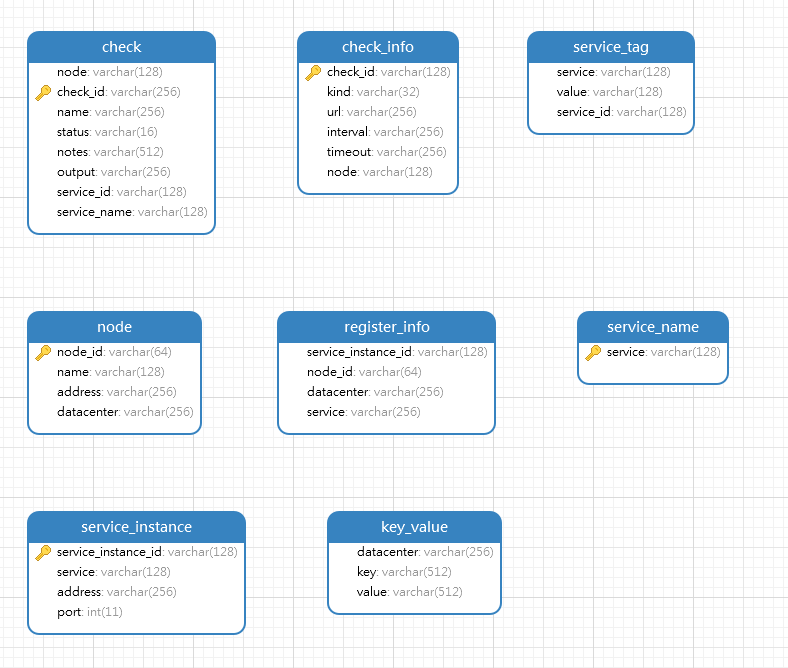

# yeasul
亿联定制版服务注册与发现中心，具备心跳检测功能，由于接口参考了consul，所以取名为yeasul。

# 项目架构

使用Java语言开发，依赖于MySQL 8.0数据库，基于Spring Boot 2.1.6开发。Yeasul会将服务信息持久化到数据库，并在每次重新启动Yeasul时，会重新开启对服务的健康检查。在集群情况下，集群中的每个Yeasul连接的是同一个数据库，即一个集群将会共同连接一个数据库，从而保证了数据的一致性。这与consul的每个consul拥有各自独立的数据持久化存储不同。当然也可以对MySQL数据库作主从配置，防止数据库宕机。

## 数据库模型

注册进Yeasul的所有信息将会被持久化进数据库，如下为数据库的模型图。



### check表

node:负责此检查的节点名

check_id:检查的id，默认格式为service:服务实例ID

name:检查的名称，默认格式为Service '服务名称' check

status:三个值，passing,warning,failing,分别代表通过，警告和失败，实际上只用到了passing和failing。

notes:检查的备注

output:每次执行完一次检查后，将会更新output的值，比如HTTP GET http://127.0.0.1:8500 200 OK Output:Apollo

service_id:检查的服务ID

service:检查的服务的名称

### check_info表

> 此表用于持久化检查的信息，用于在每次yeasul重启时，能够继续执行原有的检查

check_id:检查的id，默认格式为service:服务实例ID

kind:检查的方式，http,tcp

url:检查的url，http的形式如http://127.0.0.1:8500/index，tcp的形式如127.0.0.1:8500

interval:定义间隔多久执行一次检查，例如5s表示每隔5秒执行一次检查，支持的单位有ns,us,ms,s,m,h(纳秒，微妙，毫秒，秒，分，时)

timeout:定义检查的超时时间，格式与interval相同。若超出超时时间没有得到正确的相应，则会将**check表**中的对应的check_id的记录的status置为failing。反之为passing。

node:负责执行此检查的节点名称

### service_name表

> 此表用于记录注册在数据库中所有的服务名称

service:服务名称

### key

# 上手指南

帮助你在本地机器上安装和运行该项目，进行开发和测试。关于如何将该项目部署到在线环境，请参考部署小节。

## 环境要求

- JDK 1.8.0_144

- MySQL 8.0

## 环境配置

### 数据库配置

创建名为consul_schema的数据库，并使用consul-server-8500模块下的consul_schema.sql创建表。

### application.yml配置

```yaml
server:
  port: 8500	#设置服务端端口号
spring:
  datasource:
    username: root	#数据库账户
    password: 123456	#数据库密码
    url: jdbc:mysql://62.234.44.124:3306/consul_schema	#数据库url
    driver-class-name: com.mysql.cj.jdbc.Driver	
  http:
    converters:
      preferred-json-mapper: gson #必须使用gson，否则健康检查会出错，必须！
mybatis:
  mapper-locations: classpath:/mappers/*.xml
  type-aliases-package: com.yealink.entities
  configuration:
    map-underscore-to-camel-case: true
consul:
  debug-config:
    bind-address: 10.83.2.93	#设置本服务端IP地址
  config:
    node-name: myNode1	#设置节点名，必要，且节点名唯一
    datacenter: CN_DC1 #设置数据中心名，要加入同一集群，需设置相同的数据中心名

```

# 快速开始

经过上面的环境搭建，并可以运行yeasul了。

使用浏览器访问,127.0.0.1:8500，如果正常进入页面，就表示你已经可以开始使用yeasul了。
